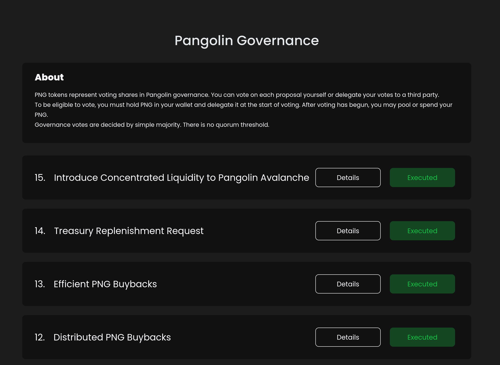

# Honeycomb Governance
Components to interact with Pangolin's governance contracts.

## Installation
`yarn add @pangolindex/portfolio`

or

`npm install @pangolindex/portfolio`

### Install below dependancies as its peer dependancies

```
react
react-dom
@pangolindex/sdk
```

## Getting Start
In your main file wrap your app with `HoneycombProvider` and `Web3ReactProvider`:

_Use version **6.0.9** of `@web3-react/core` package._

```tsx
import { HoneycombProvider } from '@pangolindex/honeycomb-provider';
import { NetworkContextName, useActiveWeb3React } from '@pangolindex/shared';
import { Web3ReactProvider, createWeb3ReactRoot } from '@web3-react/core';
import React from 'react';
import ReactDOM from 'react-dom';
import './index.css';
import App from './App';

const Web3ProviderNetwork = createWeb3ReactRoot(NetworkContextName);

function getLibrary(provider: any): Web3Provider {
  try {
    const library = new Web3Provider(provider, 'any');
    library.pollingInterval = 15000;
    return library;
  } catch (error) {
    return provider;
  }
}

// library -> web3.js provider
// chainId -> chain id with which user is connected
// account -> user's connected wallet address
// theme -> optional ( refer Theme guide to customize it )
ReactDOM.render(
  <React.StrictMode>
    <Web3ReactProvider getLibrary={getLibrary}>
      <Web3ProviderNetwork getLibrary={getLibrary}>
        <HoneycombProvider library={library} chainId={chainId} account={account} theme={theme}>
          <App />
        </HoneycombProvider>
      </Web3ProviderNetwork>
    </Web3ReactProvider>
  </React.StrictMode>,
  document.getElementById('root'),
);
```

## Story Book

1. do `yarn storybook` to start the storybook
2. now connect to http://localhost:6006 to see the components

## Development

1. `yarn install`
2. `yarn dev` and keep that terminal running

or see the [README file](/monorepo/README.md) in monorepo to run the example app.

## Components

### GovernanceList
This component list all proposals.



### GovernanceDetail
This component list all proposals.


