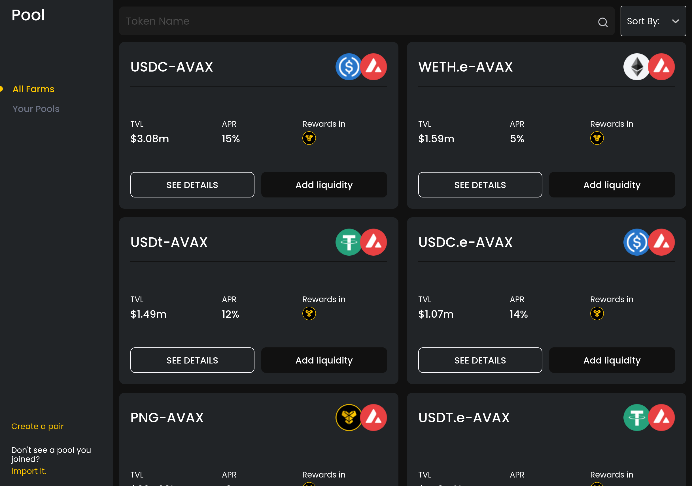
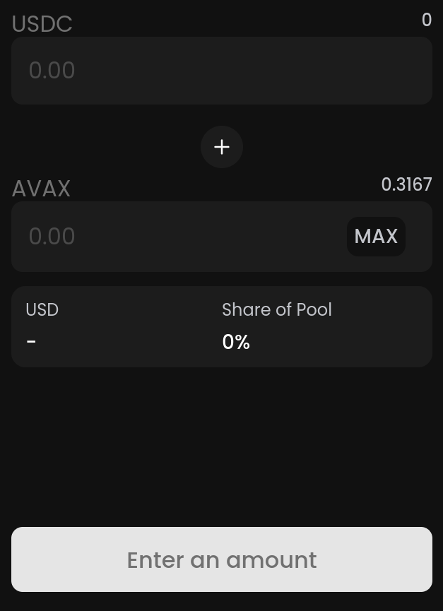
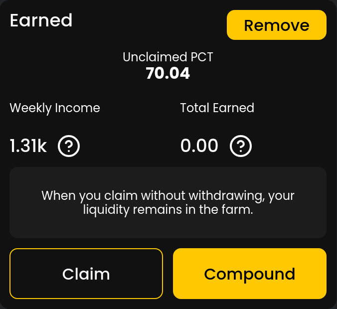
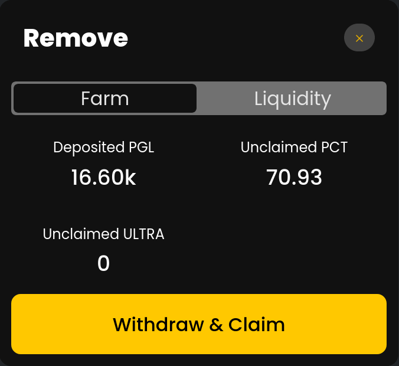

## PoolsUI

This is the **main** component, it contains all the components to add/remove liquidity, stake/remove farms, see farm, see pools and etc.

## AddLiquidity
This component handle with logic to add a liquidity in a pool.

There is two variations
- **AddLiquidityDrawer**, this is the AddLiquidity wrapped with the Drawer component to behave like a Drawer.
- **AddLiquidityModal**, this is the AddLiquidity wrapped with the Modal component to behave like a Modal and with a sectgion to select the tokens to add liquidity.

## CoinDescription

This component show the descripton from a token/coin.

## ClaimDrawer
This component is a drawer that handle with logic to claim the rewards from a farm.

## DetailModalThis component is a modal that shows all informations about the farm, tokens descriptions, add liquidity, stake to farm, see rewards and etc.

## EarnWidget
This component show the farms rewards, compound or claim or remove from farm and liquidity.

## FarmDrawer
This component handle with logic to stake liquidty to farm.

## Pools
This component show a list of farms.

## RemoveDrawer
This component is a drawer with RemoveFarm and RemoveLiquidity together.

## RemoveFarm  
This component handle with logict to remove the liquidity from a farm.

## RemoveLiquidity
This component handle with logict to remove the liquidity.

There is two variations
- **RemoveLiquidityDrawer** this is the RemoveLiquidity wrapped in a Drawer.
- **RemoveLiquidityWidget** this is the RemoveLiquidity with a text.

## Wallet
This component show the user's liquidity in wallet.

