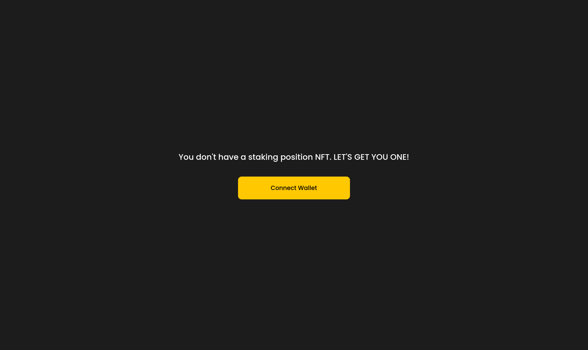

# Pangolin Sar Single Stake
Components to interact with Pangolin's Sunshine and Rainbows Single Stake contracts, [see more about Sunshine and Rainbows](https://blog.pangolin.exchange/pangolin-launches-sunshine-and-rainbows-the-ultimate-staking-algorithm-for-sticky-liquidity-80a099515bea).

## Installation
`yarn add @pangolindex/sar`

or

`npm install @pangolindex/sar`

### Install below dependancies as its peer dependancies

```
react
react-dom
@pangolindex/sdk
```

## Components

### SarManageWidget
This component is used to manage a position, stake more tokens or unstake, claim rewards or compound pending rewards to position.


### SarNFTPortfolio
This component is used to see the nfts/postions from a connected account.



### SarStakeWidget
This component is used to create a new position.


